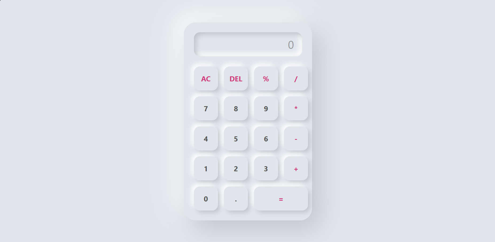

# web_technology_calculator
# Simple Calculator

A responsive and user-friendly calculator built using HTML, CSS, and JavaScript. This project performs basic arithmetic operations with a clean and modern interface.

## Features

- Addition (+)
- Subtraction (-)
- Multiplication (*)
- Division (/)
- Percentage (%)
- Decimal calculations
- Clear all (AC)
- Delete last character (DEL)
- Responsive design

## Technologies Used

- HTML5
- CSS3
- JavaScript 

## Project Structure

```
calculator/
│
├── index.html
├── style.css
├── script.js
└── README.md
```

## How to Run

1. Clone this repository:

```bash
git clone https://github.com/malarmozhi-710/codealpha_task_calculator.git
```

2. Open the project folder.

3. Run `index.html` in your browser.

## Screenshots

Add screenshots of your calculator here.

Example:



## Future Improvements

- Keyboard support
- Scientific calculator functions
- Dark/Light theme toggle
- Calculation history
- Mobile app version

## Learning Outcomes

Through this project, I learned:

- DOM manipulation using JavaScript
- Event handling
- Building responsive layouts with CSS Grid
- Implementing calculator logic
- Project organization and GitHub workflow

## Author

Malar Mozhi M

GitHub: https://github.com/malarmozhi-710

## License

This project is open source and available under the MIT License.
